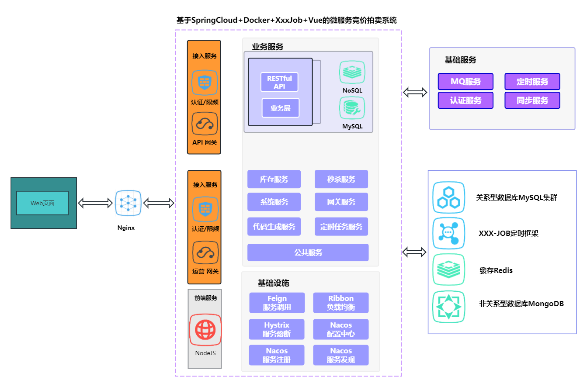

# springcloud_xxxjob_docker_vue
  基于SpringCloud+Docker+xxx-Job的微服务竞价拍卖系统

#### 介绍

(1).基于SpringCloud+Docker+xxx-Job的微服务竞价拍卖系统，本系统主要实现竞价商品的拍卖，可通过xxx-job定时启动拍卖程序，项目包含拍卖报名>交易>公示>结束等整个拍卖的完整流程。

(2).项目包含前端和后端完整代码，开箱即用，代码注释完整可读性强，方便进行二次开发

    

#### 软件架构

2.技术栈
开发环境：IDEA、JDK1.8、Maven、Gitlab

软件架构：Nginx+SpringCloud + Vue + MyBatis3 Dynamic Sql

Web框架：SpringCloudAlibaba 微服务框架

Orm框架：MyBatis3 Dynamic Sql

数据库：Mysql、Redis、MongoDB

配置注册: Nacos

权限控制：Shiro+Jwt

限流组件：Sentinel

实时数据传输：WebSocket

分布式定时：XXX-JOB

对象存储：Minio

在线文档：Swagger

短信推送：极光推送

部署环境：Docker

#### 安装教程

1.导入Mysql数据库 data/sql/jingjia_prod.sql

2.运行后端项目

    (1).安装nacos并导入配置文件 data/nacos/jingjia_nacos_config.zip
      
    (2).运行gateway、bid、sys、taskCenter微服务

3.运行前端项目 
    
    (1).解压前端项目data/front_code/shashi.rar

    (2).安装依赖 npm install

    (3).修改服务器的访问地址

    (4).启动项目 npm run dev
     
    (5).访问地址 http://ip:port/login  用户名/密码: hy / 123456

效果展示

参与贡献

1.黑白条纹

2.QinJ5

3.Zoe

在此特别谢鸣骄姐与Zoe的鼎力支持，感谢您们的一路相伴!!

参与讨论

1.欢迎各位朋友参与讨论

  github地址： https://github.com/xiaoyeshenger/java_pytorch_onnx_tensorrt_yolov8_vue

  gitee地址： https://gitee.com/qj-zye/java_pytorch_onnx_tensorrt_yolov8_vue

2.如需详细了解或帮助，可加我微信 ZZ449557260

